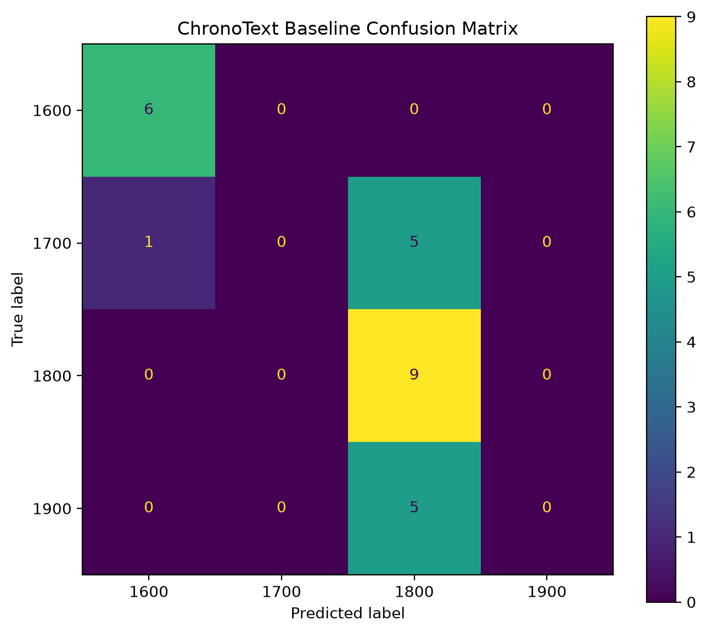

# ChronoText

ChronoText — NLP-проект для определения примерного исторического периода написания текста.

Главная идея проекта заключается не в распознавании конкретной известной книги, а в попытке определить эпоху по самому языку текста: лексике, стилю, частотности слов и другим языковым особенностям.

Например, модель должна уметь отличать текст XVII века от текста XIX или XX века, в том числе для произведений, которых не было в обучающей выборке.

## Цель проекта

Исследовать, насколько хорошо исторический период текста можно определить автоматически по его содержимому.

На текущем этапе задача сформулирована как многоклассовая классификация:

- `1600`
- `1700`
- `1800`
- `1900`

Каждый класс соответствует примерно одному столетию.

В дальнейшем задачу можно развить в сторону ordinal classification или регрессии и предсказывать более точный год написания текста.

## Почему это интересно

Язык меняется со временем. Между историческими периодами могут различаться:

- словарный запас;
- частотность слов;
- устаревшие слова и выражения;
- грамматические конструкции;
- пунктуация;
- структура предложений;
- стиль повествования.

ChronoText исследует, насколько этих различий достаточно для автоматического определения эпохи текста.

## Dataset

Текущий датасет содержит **128 литературных произведений**.

| Период | Количество текстов |
|---|---:|
| 1600 | 31 |
| 1700 | 29 |
| 1800 | 45 |
| 1900 | 23 |
| **Всего** | **128** |

Целевые метки отделены от самих текстов и хранятся в:

```text
data/metadata.csv
```

Пример:

```csv
filename,label
hamlet_1600.txt,1600
mary_barton_1800.txt,1800
```

Файлы `.txt` содержат только текст произведений.

Такое разделение важно, чтобы target не находился внутри входных данных и не создавал прямой target leakage.

## Data quality

Для проверки датасета используется:

```text
audit_dataset.py
```

Скрипт проверяет:

- наличие всех файлов, перечисленных в metadata;
- файлы, отсутствующие в metadata;
- пустые тексты;
- подозрительно короткие тексты;
- повторяющиеся записи;
- полные дубликаты текстов;
- возможное наличие старых labels внутри текста.

Во время аудита были обнаружены несколько неполных файлов, содержащих только небольшие фрагменты произведений или служебный front matter.

Они были заменены полными версиями текстов и очищены от служебных данных Project Gutenberg, таких как:

- metadata;
- даты публикации;
- editorial notes;
- contents;
- Gutenberg headers и footers.

Это особенно важно, поскольку явные даты публикации могут создавать target leakage.

Текущий результат аудита:

```text
Errors: 0
Warnings: 0
```

## Структура проекта

```text
chronotext/
├── baseline1/
│   └── model.py
│
├── data/
│   ├── metadata.csv
│   └── *.txt
│
├── audit_dataset.py
├── clean_short_texts.py
├── download_raw_texts.py
├── migrate_labels.py
├── remove_labels.py
└── README.md
```

## Baseline

В первой модели используется классический NLP pipeline:

```text
text
  ↓
TF-IDF
  ↓
Logistic Regression
  ↓
historical period
```

### TF-IDF

Текст преобразуется в разреженный вектор признаков с помощью `TfidfVectorizer`.

В текущей версии используются word-level признаки.

### Classifier

Для классификации используется:

```python
LogisticRegression
```

### Train/test split

Используется stratified split:

```python
test_size=0.2
random_state=42
```

В test set находится 26 произведений.

## Baseline results

На текущем фиксированном train/test split получены:

| Metric | Score |
|---|---:|
| Accuracy | **0.58** |
| Macro F1 | **0.39** |
| Weighted F1 | **0.44** |

Для сравнения, prediction только наиболее частого класса `1800` дал бы примерно:

```text
9 / 26 ≈ 0.35 accuracy
```

Таким образом, baseline существенно превосходит тривиальную majority-class стратегию.

При этом качество сильно различается между классами.

### Confusion matrix



Модель уверенно распознаёт классы `1600` и `1800`, но практически не предсказывает `1700` и `1900`.

В частности:

- 5 из 6 текстов `1700` классифицируются как `1800`;
- все 5 тестовых текстов `1900` классифицируются как `1800`.

Это показывает, что одной accuracy недостаточно для оценки модели.

Текущий результат также основан только на одном train/test split, поэтому его пока нельзя считать устойчивой оценкой качества.

## Ограничения baseline

На текущем этапе остаются несколько важных проблем:

- датасет относительно небольшой;
- классы немного несбалансированы;
- тексты представлены целыми произведениями;
- модель может запоминать автора или жанр вместо исторических особенностей языка;
- train/test split не контролирует попадание одного автора одновременно в train и test;
- классы имеют естественный порядок, который обычная multiclass Logistic Regression напрямую не учитывает.

Особенно важна проблема **author leakage**.

Если произведения одного автора находятся и в train, и в test, модель может научиться распознавать стиль конкретного автора, а не эпоху.

## Следующие эксперименты

### 1. Cross-validation

Вместо оценки по одному train/test split будет использоваться cross-validation.

Это позволит получить более устойчивую оценку:

```text
mean score ± standard deviation
```

### 2. Unseen-author evaluation

В `metadata.csv` будет добавлен столбец:

```text
author
```

После этого данные можно будет разделять так, чтобы авторы из test set полностью отсутствовали в train set.

Будут сравнены два режима:

```text
random split
vs
unseen-author split
```

Этот эксперимент должен показать, насколько модель действительно учит исторические особенности языка, а не просто особенности авторов.

### 3. Feature analysis

Для Logistic Regression можно исследовать веса признаков и посмотреть, какие слова сильнее всего связаны с разными историческими периодами.

Например:

```text
1600 → ...
1700 → ...
1800 → ...
1900 → ...
```

Это позволит сделать baseline более интерпретируемым.

### 4. Word vs character TF-IDF

Будут сравнены:

```text
word n-grams
vs
character n-grams
```

Character-level признаки могут быть особенно интересны для historical text classification, поскольку способны учитывать:

- старые формы слов;
- особенности орфографии;
- окончания;
- характерные последовательности символов.

## Возможные дальнейшие направления

- увеличить количество текстов;
- добавить другие жанры;
- разбивать книги на фрагменты;
- использовать метрику временной ошибки;
- попробовать ordinal classification;
- перейти от классификации века к регрессии года;
- сравнить Logistic Regression с другими линейными моделями;
- исследовать character n-grams;
- использовать более современные NLP representations.

## Используемые технологии

- Python
- scikit-learn
- TF-IDF
- Logistic Regression
- Git
- GitHub

## Установка

Клонировать репозиторий:

```bash
git clone https://github.com/Combich756/chronotext.git
cd chronotext
```

Создать virtual environment:

```bash
python3 -m venv .venv
source .venv/bin/activate
```

Установить зависимости:

```bash
pip install scikit-learn
```

## Запуск baseline

```bash
python baseline1/model.py
```

## Проверка датасета

```bash
python audit_dataset.py
```

## Главный исследовательский вопрос

> Может ли модель определить исторический период текста по языку, а не просто запомнить автора, произведение или явно указанную дату?

ChronoText начинался как простой TF-IDF + Logistic Regression baseline, но следующий этап проекта сосредоточен уже не столько на переборе моделей, сколько на корректной оценке обобщающей способности и анализе возможного leakage.
